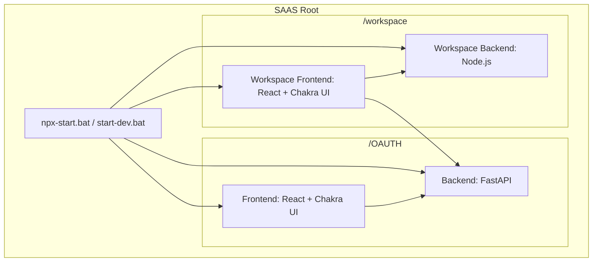

# Project Structure: SAAS Platform

This project is a multi-service SaaS platform consisting of four main components managed across two primary directories.

## Architecture Overview



## Service Breakdown

### 1. OAUTH
Located in `/OAUTH`, this directory handles authentication and identity management.
- **Backend (`/OAUTH/backend`)**: Built with **FastAPI**. It manages OAuth2 flows, user sessions (via Redis), and database interactions.
- **Frontend (`/OAUTH/frontend`)**: Built with **React** and **Vite**. It provides the UI for login, signup, and OAuth client management using **Chakra UI**.

### 2. Workspace
Located in `/workspace`, this directory contains the main application platform.
- **Backend (`/workspace/workspace-platform-backend`)**: A **Node.js** service that handles platform-specific logic and data.
- **Frontend (`/workspace/workspace-platform`)**: A **React** application that serves as the main dashboard and workspace interface for users.

## Technology Stack

| Component | Technology | Primary Tools |
| :--- | :--- | :--- |
| **Backends** | Python (FastAPI), Node.js | `uv`, `pytest`, `alembic`, `npm` |
| **Frontends** | React, TypeScript, Vite | `Chakra UI`, `ESLint` |
| **Infrastructure** | Docker, Redis | `docker-compose` |

## Getting Started

### Prerequisites
- Python (with `uv` recommended)
- Node.js & npm
- Redis (running locally or via Docker)

### Running the Development Environment
You can start all services simultaneously using one of the provided scripts in the root directory:

1. **Option A: Using NPX (Concurrently)**
   ```powershell
   .\npx-start.bat
   ```
2. **Option B: Using Multi-Window Command Prompt**
   ```powershell
   .\start-dev.bat
   ```

To stop all services when using `start-dev.bat`, press any key in the main terminal window to trigger the `taskkill` sequence.

---
*Generated by Antigravity - Principal Full Stack Engineer*
